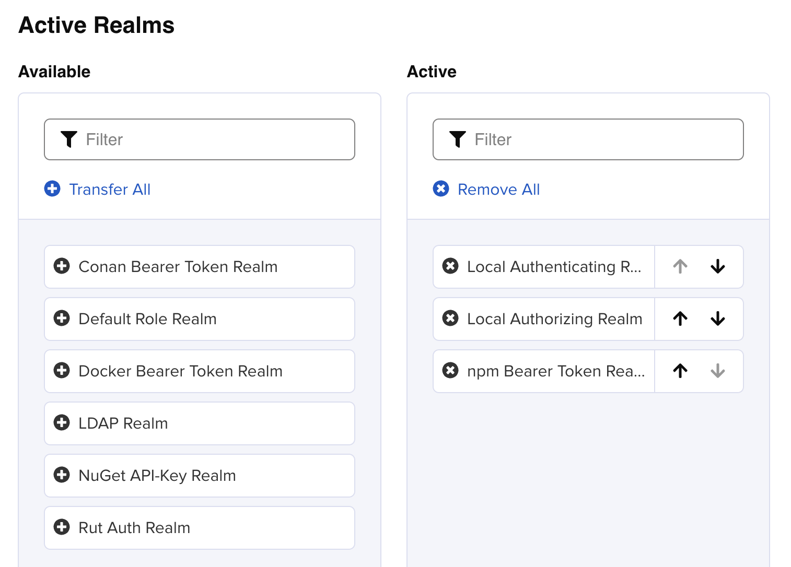
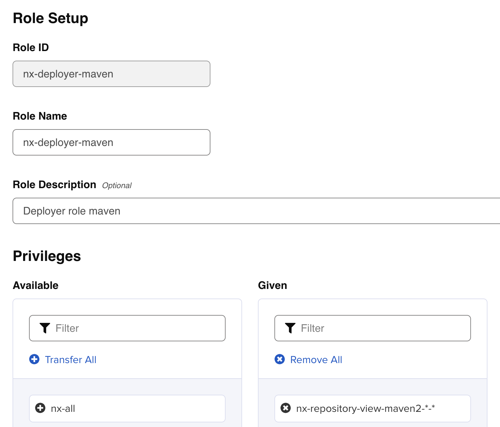
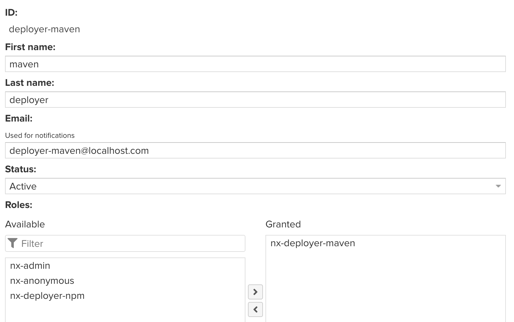
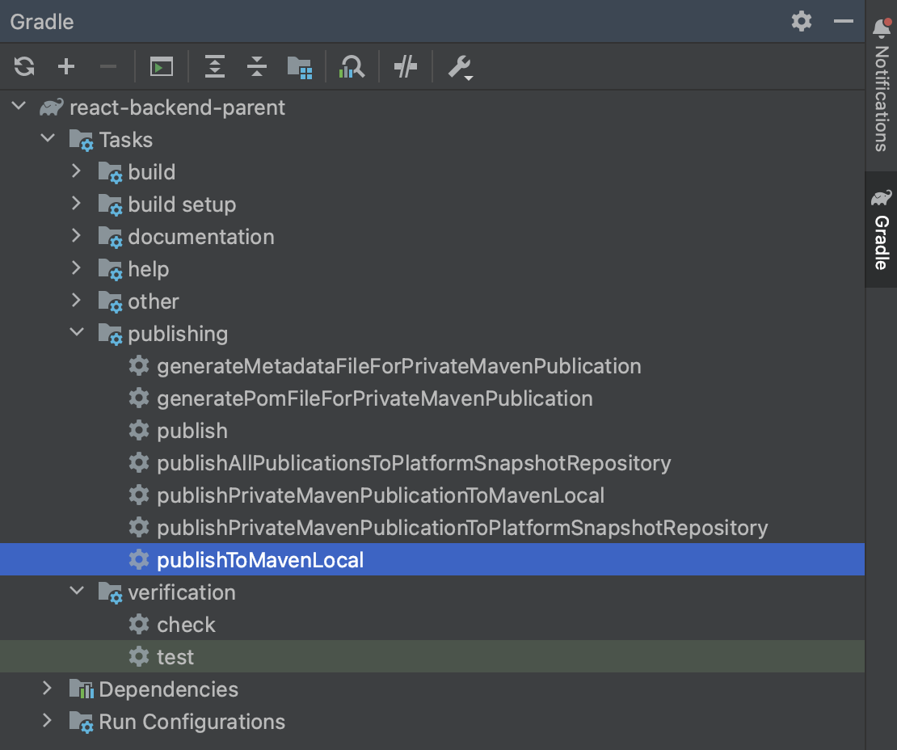
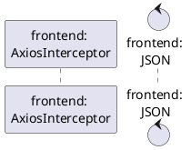
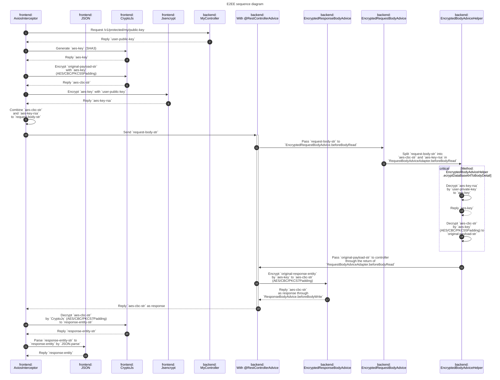
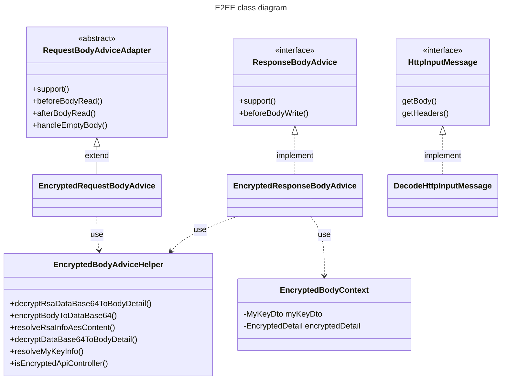
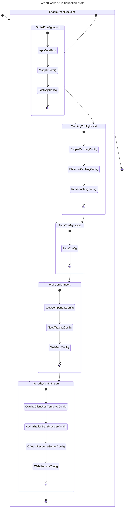
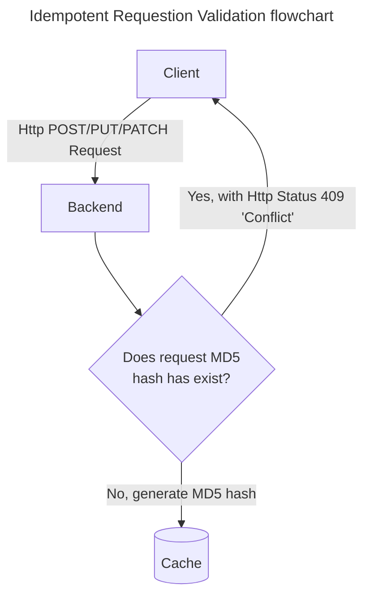

# React-backend-module
This is a lib-project for other microservices (ms-projects) to import.  
OAuth2 is integrated for the SSO with Keycloak as the development identity provider (IdP) server.  
End-to-End-Encryption (E2EE) is also introduced in this project.  


# Setup
## Gradle
### Upgrade Gradle in intellij if necessary
```shell
#./gradlew.bat wrapper --gradle-version [target version]
./gradlew.bat wrapper --gradle-version 8.10
```

### java-library
Gradle is the dependency manager for these poc projects.  
The `java-library` is the plugins in build.gradle file, NOT the `java-platform`.

```groovy
plugins {
    ...
    id 'java-library'
    ...
}
```

By using `java-library`, the ms projects used this `lib-project` which do not need to add the dependencies again.  
Because, the dependencies marked with `api` in this `lib-project` will be exported to the ms projects.  
This can align the library version along with all projects.

*lib-project*
```groovy
dependencies {
    ...
    // Use JUnit Jupiter for testing.
    testImplementation 'org.junit.jupiter:junit-jupiter:5.9.1'

    // This dependency is exported to consumers, that is to say found on their compile classpath.
    api 'org.apache.commons:commons-math3:3.6.1'

    // This dependency is used internally, and not exposed to consumers on their own compile classpath.
    implementation 'com.google.guava:guava:31.1-jre'
    ...
    api 'org.springframework.boot:spring-boot-starter-data-jpa'
    api 'org.springframework.boot:spring-boot-starter-oauth2-client'
    api 'org.springframework.boot:spring-boot-starter-oauth2-resource-server'
    api 'org.springframework.boot:spring-boot-starter-security'
    api 'org.springframework.boot:spring-boot-starter-web'
    ...
}
```

By using `java-test-fixtures`, the ms projects used this `test-fixtures-project` which do not need to add the testing dependencies again.  
Because, the dependencies marked with `testFixturesApi` in this `test-fixtures-project` will be exported to the ms projects.  
This can align the testing library version along with all projects.  
Besides, the source codes in `testFixtures/java` could be shared to ms projects.

*test-fixtures-project*
```groovy
plugins {
    ...
    id 'java-test-fixtures'
    ...
}
```

*ms-project*
```groovy
dependencies {
    implementation 'com.siukatech.poc:react-backend-module:0.0.1-SNAPSHOT'

//    implementation 'org.springframework.boot:spring-boot-starter-data-jpa'
//    implementation 'org.springframework.boot:spring-boot-starter-security'
//    implementation 'org.springframework.boot:spring-boot-starter-web'

//    implementation 'org.modelmapper:modelmapper:3.1.1'
//    implementation 'org.hibernate:hibernate-validator:6.0.13.Final'
////    implementation 'com.fasterxml.jackson.datatype:jackson-datatype-jsr310:2.15.2'

//    implementation 'org.projectlombok:lombok:1.18.26'
    annotationProcessor 'org.projectlombok:lombok:1.18.26'

    runtimeOnly 'org.postgresql:postgresql:42.6.0'

    testFixturesApi 'org.springframework.boot:spring-boot-starter-test'
    testFixturesApi 'org.springframework.security:spring-security-test'
    testFixturesApi 'com.h2database:h2:2.1.214'

//    testImplementation 'org.springframework.boot:spring-boot-starter-test'
//    testImplementation 'org.springframework.security:spring-security-test'
//    testImplementation 'com.h2database:h2:2.1.214'
////    testImplementation 'org.simplify4u:slf4j2-mock:2.3.0'

}
```

Besides, this is a library, not a bootable jar.  
Therefore, the configuration of plugin has been updated as below.  
**Reference:**  
https://stackoverflow.com/a/55731664
```groovy
plugins {
    ...
    id 'org.springframework.boot' version '3.1.0' apply false
    ...
}
```
```groovy
dependencyManagement {
    imports {
        mavenBom org.springframework.boot.gradle.plugin.SpringBootPlugin.BOM_COORDINATES
    }
}
```


### gradlew upgrade
#### wrapper
```shell
#gradle wrapper --gradle-version [version no, e.g. 7.6.1, 8.7]
gradle wrapper --gradle-version 8.7
```


#### build.gradle
```groovy
//from 17 to 21
...
java {
//    sourceCompatibility = "17"
    sourceCompatibility = "21"
}
//targetCompatibility = JavaVersion.VERSION_17
targetCompatibility = JavaVersion.VERSION_21
...
//    api 'org.projectlombok:lombok:1.18.24'
//    annotationProcessor 'org.projectlombok:lombok:1.18.24'
api 'org.projectlombok:lombok:1.18.30'
annotationProcessor 'org.projectlombok:lombok:1.18.30'
...
```


## Sonatype Nexus (private maven repository) Setup
### Docker
Since I am using Macbook Pro M2 (ARM) with docker desktop as my development environment.  
Therefore this sonatype nexus version is not compatible with other x64 machine.

- x64: [sonatype/nexus3](https://hub.docker.com/r/sonatype/nexus3/tags)
- ARM: [klo2k/nexus3:3.43.0](https://hub.docker.com/r/klo2k/nexus3/tags)


### Nexus (ARM) installation steps
Before pulling the docker image, I will create a local folder (persistence storage) as the volume for the image to mount.
```shell
echo 'export NEXUS_HOME="~/Documents/development/artifact/nexus"' >> ~/.zshrc
source ~/.zshrc
```

```shell
docker pull klo2k/nexus3:3.43.0
docker run -d -p 38081:8081 --name klo2k-nexus3-01 -v $NEXUS_HOME/klo2k-nexus3:/nexus-data klo2k/nexus3:3.43.0
```

Replace ***[container_id]*** to actual container-id by using `docker ps -a` to check.  
And password can be found in the admin.password file to check the initial admin password.
```shell
docker exec -it [container_id] /bin/bash
more /nexus-data/admin.password
```

After the launch, u can directly go to the url (http://localhost:38081) to access the nexus repository.  
Or perform a `curl http://localhost:38081/nexus/service/local/status` to check status.


### Realms, Roles and Users
#### Realms (for private npm registry)
Login Nexus Repository Manager  
Goto -> Security -> Realms  
Add `npm Bearer Token Realm` from Available to Active.  
Click `Save` after the above configuration.  



#### Roles
Login Nexus Repository Manager  
Goto -> Security -> Roles    
Click `Create Role` to create new role for maven publish.  
Role Type: Nexus role  
Role ID: nx-deployer-maven  
Role Name: nx-deployer-maven  
Role Description: Deployer role maven  
Privileges: `nx-repository-view-maven2-*-*` (This role can view all nexus maven repositories.)  
Click `Save` after the above configuration.  



#### Users
Login Nexus Repository Manager  
Goto -> Security -> Users    
Click `Create local user` to create new role for maven publish.  
ID: deployer-maven  
First name: maven  
Last name: deployer
Email: deployer-maven@localhost.com
Password: xxxxxx  
Confirm password: xxxxxx  
Status: Active  
Roles: nx-deployer-maven  
Click `Create local user` after the above configuration.  



### Gradle
```groovy
plugins {
    ...
    id 'maven-publish'
    ...
}
```

```groovy
repositories {
    mavenCentral()
}
```

```groovy
publishing {
    publications {
        privateMaven(MavenPublication) {
            def artifactIdStr = "$project.name"
            groupId "$project.group"
            version "$project.version"
            artifactId "$artifactIdStr"
            from components.java
            versionMapping {
                usage('java-api') {
                    fromResolutionOf('runtimeClasspath')
                }
                usage('java-runtime') {
                    fromResolutionResult()
                }
            }
            pom {
                name = "$artifactId"
                description = "$artifactId"
            }
        }
    }
    if (project.hasProperty("[repository-name]Uri")) {
        repositories {
//            def publishingUri = project.hasProperty("[repository-name]Uri") ? "$[repository-name]Uri" : ""
            maven {
                name = '[repository-name]'
                allowInsecureProtocol = true
                credentials(PasswordCredentials)
                url = uri("$[repository-name]Uri")
            }
        }
    }
}
```

The `[repository-name]` here is a name that can lookup the login and password from ~/.gradle/gradle.properties.  
Here is the reference from gradle official website.  
https://docs.gradle.org/current/samples/sample_publishing_credentials.html

Snippet of ~/.gradle/gradle.properties
```shell
...
[repository-name]Username=[user-login]
[repository-name]Password=[user-password]
[repository-name]Uri=[repository-url]
...
```

After the setup of above configuration, our gradle task list will be updated.  
New folder `publishing` is added. Tasks `publishXXX` are used to publish the artifacts to maven repository.  
The `[repository-name]` on screen-capture is `platformSnapshot`.  


Once `publishToMavenLocal` is clicked, the artifact will be published to your maven local. (~/.m2/repository/)


# Design
## Dependencies
*api*
- OAuth2 is required because our ms-projects are linked to an IdP.  
  As a result, the spring-boot-starter oauth2-client and oauth2-resource-server are selected.
- spring-boot-starter data-jpa is selected for the data persistence.  
  Maybe will add Mybatis later to do some poc.
- spring-boot-starter spring-security is the must to protect the resources.
- Others like modelmapper and jackson (objectmapper) are included for data binding between objects.
- Apache common-lang3 is the utility library to improve our productivity.

*testImplementation*
- spring-boot-starter-test is the main testing framework
- spring-security-test is required for authorization and authentication testing
- h2database is used to work as database during testing the repository components.


## Package
- main/java
    - business: Business services and dto
    - data: Data layer, repositories and entities
    - global: Global configuration for application
    - security: Security configuration and related classes
    - util: Utility classes
    - web
        - advice: ControllerAdvice classes
        - annotation: Custom annotations for web
        - config: Web configurations
        - context: Custom context for request-scope
        - controller: Web controller
        - helper: Helper to perform some specific logics
        - model: Form models, request models
- test/java
    - business
    - data
    - global
    - util
    - web
    - AbstractJpaTests: Abstract class with Jpa testing specific properties
    - AbstractUnitTests: Abstract class with some common unit test configuration


## Annotation
### **Controller
There are several annotations created for rest controller.
- base
    - PublicController
    - ProtectedController
    - EncryptedController
- v1
    - ApiV1Controller
    - PublicApiV1Controller
    - ProtectedApiV1Controller
    - EncryptedApiV1Controller

And in the coming future, more will be added like.
- v**2**
    - ApiV**2**Controller
    - PublicApiV**2**Controller
    - ProtectedApiV**2**Controller
    - EncryptedApiV**2**Controller
- and etc...

The idea here is that when there is a new api version coming out which means there are some breaking changes.  
The corresponding annotations are required to created in this project.  
Since annotation has a limitation that does not support inheritance (Reference: https://stackoverflow.com/a/7761568).  
The annotations in the `base` are defined as baseline, common usages which are generic approach and required to attach to `[XXX]ApiV[X]Controller` series annotations.  
Some embedded interceptors are planning to develop to cross-check the `base` annotations for security control.


### EnableReactBackend
Enable ms-projects to contain the features in this library project.  
The concept is doing `@Import` with those `@Configuration` classes.
```java
@Import({
        GlobalConfigImport.class
        , WebConfigImport.class
        , SecurityConfigImport.class
})
```

- @EnableReactBackend.class
    - GlobalConfigImport.class
        - AppCoreConfig.class
    - WebConfigImport.class
        - DataConfig.class
        - WebConfig.class
        - WebMvcConfigSupport.class
    - SecurityConfigImport.class
        - WebSecurityConfig.class


# End-to-End-Encryption (E2EE)
Besides the annotation control, I am trying the end-to-end-encryption (E2EE) in this project by using the `EncryptedController` annotation.  
Two encryption algorithms are used for the solution.
- RSA with key-size 2048 bytes
- AES (AES/CBC/PKCS5Padding) with secret-size 32 bytes = 256 bits


## Sequence flow after login
1 & 2 `frontend: AxiosInterceptor` requests `user-public-key` from `backend` (/v1/protected/my/public-key)

3 & 4 `frontend: AxiosInterceptor` generates `aes-key` by `CryptoJs` (SHA3)

5 & 6 `frontend: AxiosInterceptor` encrypts `original-payload-str` by `CryptoJs` (AES/CBC/PKCS5Padding) to `aes-cbc-str`

7 & 8 `frontend: AxiosInterceptor` encrypts ~~`aes-cbc-str` and~~ `aes-key` by `Jsencrypt` with `user-public-key` to `aes-key-rsa`

9 `frontend: AxiosInterceptor` combines `aes-cbc-str` and `aes-key-rsa` to `request-body-str`

10 `frontend: AxiosInterceptor` sends `request-body-str` to `backend`

11 `backend: RestControllerAdvice` splits `request-body-str` into `aes-cbc-str` and `aes-key-rsa` in `RequestBodyAdviceAdapter.beforeBodyRead`

12 & 13 `backend: EncryptedRequestBodyAdvice` decrypts `aes-key-rsa` by `user-private-key` to `aes-key`

14 `backend: EncryptedBodyAdviceHelper` decrypts `aes-cbc-str` by `aes-key` (AES/CBC/PKCS5Padding) to `original-payload-str`

15 `backend: EncryptedBodyAdviceHelper` passes `original-payload-str` to controller through the return of `RequestBodyAdviceAdapter.beforeBodyRead`

16 `backend: RestControllerAdvice` encrypts `original-response-entity` by `aes-key` to ~~`aes-ecb-str`~~ `aes-cbc-str` (~~AES/ECB/PKCS7Padding~~ AES/CBC/PKCS7Padding)

17 `backend: EncryptedRequestBodyAdvice` returns ~~`aes-ecb-str`~~ `aes-cbc-str` as response through `ResponseBodyAdvice.beforeBodyWrite`

18 `backend: RestControllerAdvice` Sends ~~`aes-ecb-str`~~ `aes-cbc-str` as response

19 & 20 `frontend: AxiosInterceptor` decrypts ~~`aes-ecb-str`~~ `aes-cbc-str` by `CryptoJs` (~~AES/ECB/PKCS7Padding~~ AES/CBC/PKCS7Padding) to `response-entity-str`

21 & 22 `frontend: AxiosInterceptor` parses `response-entity-str` to `response-entity` by `JSON.parse`


Original plan is using plantuml but mermaid looks having a better support on Github.  
**Reference:**  
https://plantuml.com/sequence-diagram  
https://mermaid.js.org/syntax/sequenceDiagram.html














## Prerequisite
The ms-project `user-service` is required to turn on as the user info provider.  
To facilitate the development, this lib-project has a simple `MyController` implementation.  
Those ms-projects can extend this `MyController` to expose the `my-key-info` api with `UserDto` as return.  
This `MyKeyDto` object provides the user-private-key for application to perform the `aes-key` decryption.
```yaml
app:
  host-name: [host-name of user-service]
  api:
    my-user-info: [my-user-info api on user-service, e.g. /v1/protected/my/user-info]
    my-key-info: [my-key-info api on user-service, e.g. /v1/protected/my/key-info]   <-----
```

A RuntimeException will be thrown if the `my-key-info` api is not available when there is an `/encrypted` api call.


## Findings
The `Jsencrypt` does not support using `user-public-key` to decrypt.  
The better approach should be using `user-private-key` to encrypt data at backend and frontend uses the `user-public-key` for decryption.  
~~On frontend, the `CryptoJs` (AES/CBC) is hard to decrypt the java `aes-cbc-str` (AES/CBC).~~  
~~Finally only the `CryptoJs` (AES/ECB) can decrypt java `aes-ecb-str` (AES/ECB).~~  
On frontend, the `CryptoJs` (AES/CBC) can decrypt the java `aes-cbc-str` (AES/CBC) with correct `iv`.  
The `iv` is required the byte array format which means the decoding should be happened before.  
The `CryptoJS.enc.Base64.parse([base64-str])` decodes `base64-str` to `byte-array`.

**Reference:**  
https://github.com/kyungw00k/encrypt-something-in-java-and-decrypt-it-in-javascript-by-example

Here is a snippet from frontend project.

```javascript
...
const decryptedDataBase64 = dataRet;
const encryptedAesData = CryptoJS.enc.Base64.parse(decryptedDataBase64);
const decodedKey = CryptoJS.enc.Base64.parse(cipherInfo.key);
const decodedKeyStr = decodedKey.toString(CryptoJS.format.Utf8);
const decodedIv = CryptoJS.enc.Base64.parse(cipherInfo.iv);
const decryptedData = CryptoJS.AES.decrypt(
  { ciphertext: encryptedAesData },
  decodedKey,
  {
    // mode: CryptoJS.mode.ECB,
    mode: CryptoJS.mode.CBC,
    iv: decodedIv,
  }
);
const dataStr = decryptedData.toString(CryptoJS.enc.Utf8);
dataRet = JSON.parse(dataStr);
...
```

Besides, there is a RSA key length limitation.
The RSA key cannot encrypt content that exceeds the defined length (key-size minuses some factors).  
As a result, RSA is designed to encrypt small content, such as `aes-key`.  
The proper way should be similar to reference below.

**Reference:**  
https://mbed-tls.readthedocs.io/en/latest/kb/cryptography/rsa-encryption-maximum-data-size/

> 1. Generate a 256-bit random `key-str`
> 2. Encrypt data with `AES/CBC` as `aes-data` with `key-str`
> 3. Encrypt `key-str` with RSA key-pair, either `public-key` or `private-key`
> 4. Send encrypted `key-str` and `aes-data` to the other side

Since the length of `aes-key` is fixed, currently is `344` for this setup.  
Then I composed the `aes-key` and `aes-data` together.  
And split them by the fixed length rather than adding separator.

Moreover, there is not payload embedded in GET method calls.  
The `aes-key` is also attached to `http-header` for `ResponseBodyAdvice.beforeBodyWrite` to perform the `aes-key` decryption and `response-body` encryption.

I also tried the AES/GCM on backend but failed on frontend.  
So the AES/CBC is default encryption algorithm.


# Idempotent Request Validation


## Flowchart


## Sequence diagram
1 & 2 `frontend: AxiosInterceptor` requests `user-public-key` from `backend` (/v1/protected/my/public-key)


# Spring Boot Upgrade ***
## From 3.1.0 => 3.2.1
After upgrade to `Spring Boot` `3.2.1`, `@PathVariable` behavior is changed.  
This can be fixed by update build.gradle or adding maven plugin.

Manually indicate the name of the variable one by one.
```java
...
@PostMapping("/test/{id}")
public ResponseEntity<?> test(@PathVariable
    // name is required for framework to look up the parameter name
    (name = "id") 
    id) {
        // do something
}
...
```


Better solution by using build.gradle (gradle) or pom.xml (maven).
```groovy
...
tasks.withType(JavaCompile).configureEach {
    options.compilerArgs.add("-parameters")
}
...
```
```xml
...
<plugin>
    <groupId>org.apache.maven.plugins</groupId>
    <artifactId>maven-compiler-plugin</artifactId>
    <configuration>
        <parameters>true</parameters>
    </configuration>
</plugin>
...
```


**Reference:**  
https://stackoverflow.com/a/77691302    
https://github.com/spring-projects/spring-framework/wiki/Upgrading-to-Spring-Framework-6.x#parameter-name-retention


## From 3.3.7 => 3.4.2
Hibernate would be upgraded to 6.6.2.Final by following the `Spring Boot` upgrade.  
Version 6.6 introduces a lot of breaking changes which behavior differently with 6.5 or lower versions.  

### SQL Generation


### Optimistic Lock Exception detection mechanism


**Reference:**  
https://stackoverflow.com/a/79229425


# Annotation
## @Slf4j
Using `@Slf4j`, after compilation, following statement will be added to the class.
```java
...
private static final Logger log = LoggerFactory.getLogger(xxx.class);
...
```


# Spring Validation
Use `jakarta` instead of `javax` for jakarta bean validation.  

## build.gradle
build.gradle is required to update for lombok in test.  
```groovy
...
testImplementation 'org.projectlombok:lombok:1.18.30'
testAnnotationProcessor 'org.projectlombok:lombok:1.18.30'

testFixturesApi 'org.projectlombok:lombok:1.18.30'
testFixturesAnnotationProcessor 'org.projectlombok:lombok:1.18.30'
...
```

Import the `jakarta` validation library.  
```groovy
...
api 'org.hibernate:hibernate-validator:6.0.13.Final'
...
```

**Reference:**  
https://www.baeldung.com/java-validation  


# Exception Handler
`GlobalExceptionHandler` uses `@ControllerAdvice` and extends `ResponseEntityExceptionHandler`.  
Override `handleMethodArgumentNotValid` and prepare the `ErrorDetail` object with codes from `FieldError` object.  

In unit-test class, some annotations are required, like `@EnableWebMvc`.  
```java
@Slf4j
@SpringBootTest(classes = {GlobalExceptionHandler.class
        , GlobalExceptionHandler_controller.class}
    , properties = {
        "logging.level.com.siukatech.poc.react.backend.module.core.web.advice.handler=DEBUG"
        , "logging.level.com.siukatech.poc.react.backend.module.core.web.advice.model=DEBUG"
    }
)
@EnableWebMvc // If missing @EnableWebMvc, status 415 will be thrown
@WebAppConfiguration
public class GlobalExceptionHandlerTests {
    ...
}
```


## Http Status 415 returned when ...
Http status 415 returned when:    
- `MockMvcRequestBuilders.contentType` is missing for method `POST`
- `@EnableWebMvc` is missing when using `@SpringBootTest`


# Caching
By using `@ConditionalOnProperty` with checking `prefix = "spring.cache.type"` to determine which caching configuration to load.
- spring.cache.type=simple - Simple
- spring.cache.type=ehcache - Ehcache
- spring.cache.type=redis - Redis
- No `spring.cache.type` - No caching

The embedded redis server is used for redis cache unit test.  
`RedisProperties` from `org.springframework.boot.autoconfigure.data.redis` is also used as the redis properties class.  
Configuration in yaml would be:  
```yaml
...
spring:
  data:
    redis:
      host: localhost
      port: 6379
      username: xxx
      password: xxx
      client-type: LETTUCE or JEDIS
...
```

**Reference:**  
https://jdriven.com/blog/2024/10/Spring-Boot-Sweets-Using-Duration-Type-With-Configuration-Properties    
https://docs.spring.io/spring-boot/reference/io/caching.html#io.caching.provider.redis  


